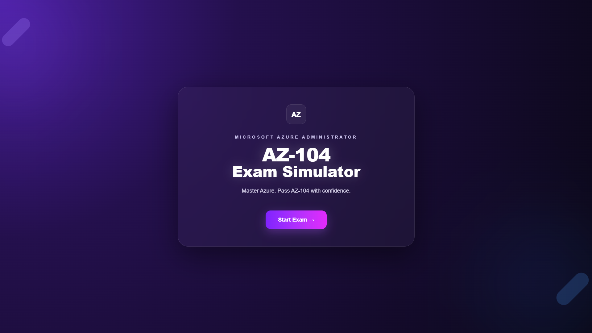

# AZ-104 Exam Simulator

The **AZ-104 Exam Simulator** is a free web application designed to help candidates prepare for the **Microsoft Azure Administrator (AZ-104)** certification through realistic practice exams.

Unlike traditional question banks, the simulator provides AI-powered explanations after each answer to help users understand the underlying Azure concepts rather than simply memorize solutions.

The project is intended to complement the **Azure Infrastructure Roadmap**, allowing users to study the theory, practice with realistic questions, and identify areas that require further review.

## 🚀 Live Demo

## 📚 Azure Infrastructure Roadmap

Continue your study using the companion documentation covering the official AZ-104 exam objectives.

## Features

- Realistic AZ-104 practice exams
- AI-powered answer explanations
- Practice Mode
- Performance summary after each exam
- Mobile-friendly interface
- Integration with the Azure Infrastructure Roadmap

## Technology

- Next.js
- React
- TypeScript
- Tailwind CSS
- Google Gemini API
- Vercel

## About the AI

The explanations generated by the simulator use the **Google Gemini API**.

To keep the simulator freely accessible, all API costs are currently covered by the project author. If usage grows significantly, the project may evolve to ensure it remains sustainable while continuing to provide free access whenever possible.

---

This project is an independent educational resource and is **not affiliated with or endorsed by Microsoft**.

If you find the simulator useful, consider giving the repository a ⭐.
